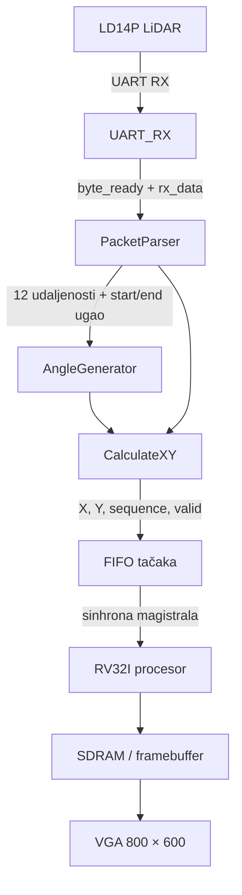
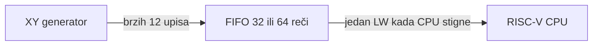

# LD14P LiDAR na FPGA sistemu sa RISC-V procesorom, SDRAM-om i VGA monitorom

## 1. Cilj projekta

Cilj projekta je da se podaci sa rotacionog LiDAR senzora **LDROBOT LD14P** prime na FPGA pločici, obrade u hardveru, učine dostupnim sopstvenom **RV32I procesoru** preko sinhrone magistrale i zatim prikažu na VGA monitoru rezolucije **800 × 600 piksela**.

Sistem treba da izvrši sledeće korake:

1. primi serijski UART tok sa LiDAR-a;
2. prepozna i rastavi LiDAR paket;
3. izdvoji 12 merenja udaljenosti iz svakog paketa;
4. izračuna ugao svake od 12 tačaka;
5. pretvori polarne koordinate `(udaljenost, ugao)` u Dekartove koordinate `(x, y)`;
6. preslika koordinate iz milimetara u VGA piksele;
7. svakoj tački dodeli redni broj unutar trenutne revolucije;
8. upakuje tačku u 32-bitnu reč;
9. preda tačke procesoru bez njihovog gubljenja;
10. omogući procesoru da tačke upiše u SDRAM ili prosledi VGA podsistemu.

Najvažniji tok podataka može se predstaviti ovako:



---

## 2. Šta LiDAR zapravo meri

LD14P je rotacioni 2D LiDAR. Njegova glava se okreće, a senzor tokom rotacije meri udaljenost do objekata u različitim pravcima.

Jedno pojedinačno merenje sadrži najmanje:

- ugao pravca u kome je merenje napravljeno;
- udaljenost do prepreke;
- intenzitet ili confidence podatak, koji opisuje pouzdanost povratnog laserskog signala.

LiDAR ne šalje odmah `(x, y)` koordinate. On šalje podatke u polarnom obliku:

```text
(ugao, udaljenost)
```

Na primer:

```text
ugao       = 9000
udaljenost = 2000 mm
```

Pošto je ugao izražen u stotim delovima stepena:

```text
9000 = 90.00°
```

Merenje predstavlja objekat udaljen 2 m u pravcu od 90°.

### Jedinice korišćene u projektu

| Veličina | Jedinica | Primer |
|---|---:|---:|
| `distance` | milimetar | `2000 = 2 m` |
| `angle` | 0,01 stepen | `1234 = 12,34°` |
| puna rotacija | 0,01 stepen | `36000 = 360°` |
| Q15 sinus | celobrojna aproksimacija | `32767 ≈ 1,0` |
| X/Y izlaz | VGA piksel | `(400,300)` je centar |

Broj tačaka u jednoj revoluciji nije nužno fiksno 666. On zavisi od brzine rotacije i frekvencije uzorkovanja. Zbog toga se tačka ne sme numerisati globalno od uključivanja sistema, već se brojač mora vratiti na nulu kada se prepozna nova revolucija.

---

## 3. UART prijemnik

### 3.1. Zašto je potreban UART RX blok

LiDAR šalje bitove serijski preko jedne RX linije. FPGA radi paralelno, pa blok `UART_RX` mora da:

1. sinhronizuje asinhroni RX signal sa FPGA taktom;
2. pronađe opadajuću ivicu start bita;
3. uzorkuje osam podatkovnih bitova;
4. proveri start i stop bit;
5. sastavi primljeni bajt;
6. podigne `byte_ready` na jedan takt.

UART okvir izgleda ovako:

```text
idle=1 | start=0 | d0 | d1 | d2 | d3 | d4 | d5 | d6 | d7 | stop=1
```

Bitovi podataka dolaze redosledom od najmanje značajnog bita, odnosno `d0` dolazi prvi.

### 3.2. Sinhronizacija RX signala

Pošto RX nije sinhron sa FPGA taktom, direktno dovođenje na logiku može izazvati metastabilnost. U `UART_RX.v` koriste se dva uzastopna flip-flopa:

```text
rx → DFF_inst → rx_sync
```

Tek se `rx_sync` koristi u ostatku prijemnika. Prethodna vrednost `rx_prev` omogućava detekciju opadajuće ivice:

```text
falling_edge = ~rx_sync & rx_prev
```

Ta ivica predstavlja potencijalni početak UART karaktera.

### 3.3. Problem trenutnog baud generatora

Za sistemski takt od 50 MHz i baud rate od 230400, trajanje jednog UART bita je približno:

$$
N_{bit}=\frac{50\,000\,000}{230\,400}\approx217{,}01\ \text{taktova}
$$

Trenutni `BAUD_GENERATOR` pravi tick približno na 14 sistemskih taktova, dok `UART_RX` koristi 16 takvih tick-ova po UART bitu:

$$
14\cdot16=224\ \text{taktova po bitu}
$$

To je sporije od potrebnih približno 217 taktova. Greška je dovoljno velika da prijemnik može ostati zauzet kada počne sledeći UART bajt i zato propustiti njegov start bit.

Za završnu verziju treba koristiti precizniji generator, na primer:

- fazni akumulator za `16 × 230400 Hz`; ili
- brojač sistemskih taktova koji uzorkuje na sredini svakog bita;
- PLL takt pogodan za celobrojno generisanje baud frekvencije.

Pri prezentaciji je važno objasniti da UART ne mora imati identičan takt kao predajnik, ali uzorkovanje mora ostati dovoljno blizu sredine svakog bita tokom celog karaktera.

---

## 4. Struktura LD14P paketa i PacketParser

Parser iz projekta očekuje paket od 47 bajtova sa 12 tačaka. Logička struktura je:

| Polje | Veličina | Namena |
|---|---:|---|
| Header | 1 B | početak paketa, očekuje se `0x54` |
| VerLen | 1 B | format/verzija i dužina, očekuje se `0x2C` |
| Speed | 2 B | brzina rotacije |
| Start angle | 2 B | ugao prve tačke |
| Point 0–11 | 36 B | 12 × `(distance 2 B + confidence 1 B)` |
| End angle | 2 B | ugao poslednje tačke |
| Timestamp | 2 B | vremenska oznaka |
| CRC | 1 B | provera ispravnosti paketa |

Ukupno:

$$
1+1+2+2+36+2+2+1=47\ \text{bajtova}
$$

### 4.1. Pronalaženje početka paketa

Kada prijemnik izbaci `byte_ready`, parser prvo traži:

```text
Header = 0x54
```

Ako ga pronađe dok nije unutar paketa, postavlja `in_packet=1`. Sledeći bajt mora biti `0x2C`. Ako nije, parser napušta paket i ponovo traži header.

Ovakav postupak se zove resynchronization: čak i ako sistem počne da sluša usred paketa, nakon nekog vremena ponovo će pronaći pravilnu granicu paketa.

### 4.2. Brojač pozicije bajta

`byte_pos` se povećava samo kada važi:

```text
in_packet & byte_ready
```

Na određenim pozicijama parser učitava:

- brzinu;
- početni ugao;
- 12 udaljenosti;
- 12 confidence vrednosti;
- završni ugao;
- timestamp.

Višebajtne vrednosti LiDAR šalje little-endian redosledom. Ako se prvo prime `LOW`, pa `HIGH`, konačna 16-bitna vrednost je:

```text
value = {HIGH, LOW}
```

Za primer:

```text
LOW  = 0xD0
HIGH = 0x07
value = 0x07D0 = 2000
```

To znači udaljenost od 2000 mm.

### 4.3. `data_ready` i potvrda obrade

Kada se primi ceo paket, parser postavlja `data_ready`. Taj signal ostaje aktivan dok blok iznad njega ne pošalje `ack`.

Zato `data_ready` nije jedn taktni impuls. Ako se koristi kao `LD` za registar, registar će se učitavati svakog takta dok je `data_ready=1`. U trenutnoj verziji ovo izaziva grešku u brojanju tačaka po revoluciji.

Potrebno je napraviti impuls:

```text
packet_accept = data_ready & ~busy
```

`packet_accept` je aktivan samo na početku obrade novog paketa i treba da učitava:

- `prev_start_angle`;
- `seen_packet_reg`;
- `packet_base_seq`;
- ostale registre koji se menjaju samo jednom po paketu.

### 4.4. CRC

Trenutni parser ne proverava CRC bajt. To znači da električni šum ili izgubljen bit mogu proizvesti pogrešnu udaljenost ili ugao koji će ipak biti označen kao spreman.

Za demonstraciju geometrije CRC se može privremeno izostaviti. Za pouzdan finalni sistem potrebno je:

1. računati CRC tokom prijema bajtova;
2. uporediti rezultat sa poslednjim bajtom paketa;
3. postaviti `data_ready` samo kada se CRC poklapa.

---

## 5. Generisanje uglova 12 tačaka

LiDAR u paketu daje `start_angle` prve i `end_angle` poslednje tačke. Između njih se nalazi ukupno 12 ravnomerno raspoređenih merenja.

Zbog toga između prve i poslednje tačke postoji 11 intervala:

$$
\Delta\theta=\frac{angle\_range}{11}
$$

### 5.1. Izračunavanje opsega sa prelaskom preko nule

Ako paket ne prelazi 360°:

```text
end_angle >= start_angle
angle_range = end_angle - start_angle
```

Ako paket prelazi sa kraja na početak kruga:

```text
end_angle < start_angle
angle_range = 36000 - start_angle + end_angle
```

Primer:

```text
start_angle = 35800 = 358°
end_angle   =   200 =   2°
angle_range = 36000 - 35800 + 200 = 400 = 4°
```

### 5.2. Deljenje sa 11 bez delitelja i množitelja

Za BDF implementaciju može se koristiti aproksimacija:

$$
\frac{1}{11}\approx\frac{745}{8192}
$$

Pošto važi:

$$
745=512+256-32+8+1
$$

dobija se:

$$
\Delta =
\left(
(range\ll9)+(range\ll8)-(range\ll5)+(range\ll3)+range+4096
\right)\gg13
$$

Konstanta 4096 služi za zaokruživanje pre odbacivanja donjih 13 bitova.

Blokovski postupak je:

```text
range32 = zero_extend(angle_range)

S1 = (range32 << 9) + (range32 << 8)
S2 = S1 - (range32 << 5)
S3 = S2 + (range32 << 3)
S4 = S3 + range32
S5 = S4 + 4096

delta = S5[28:13]
```

Ne treba posebno pomerati `range` udesno više puta, jer bi svaka grana prerano odbacila razlomljene bitove. Sve međurezultate treba čuvati na 32 bita i samo jednom uzeti završne bitove `[28:13]`.

Primeri:

| `angle_range` | Idealno `/11` | Shift/add rezultat |
|---:|---:|---:|
| 100 | 9,09 | 9 |
| 300 | 27,27 | 27 |
| 600 | 54,55 | 55 |
| 900 | 81,82 | 82 |
| 1200 | 109,09 | 109 |
| 2000 | 181,82 | 182 |

### 5.3. Formiranje svih uglova

Uglovi se mogu formirati rekurzivno:

```text
angle_p0  = start_angle
angle_p1  = wrap(angle_p0 + delta)
angle_p2  = wrap(angle_p1 + delta)
...
angle_p10 = wrap(angle_p9 + delta)
angle_p11 = end_angle
```

Poslednji ugao je najbolje direktno povezati na `end_angle`. Tako se sprečava da mala greška zaokruživanja raste kroz svih 11 sabiranja.

Funkcija `wrap` znači:

```text
if temporary_angle >= 36000:
    angle = temporary_angle - 36000
else:
    angle = temporary_angle
```

Poređenje mora biti `greater OR equal`, jer i tačno `36000` treba pretvoriti u `0`.

---

## 6. Sinusni ROM i korišćenje kvadranata

Čuvanje sinusa za svih 36000 mogućih uglova nepotrebno bi trošilo memoriju. Sinus i kosinus imaju simetrije, pa je dovoljno čuvati sinus samo za prvi kvadrant, od 0° do 90°.

Datoteka `sin_64_q15.mif` sadrži 64 vrednosti:

```text
ROM[0]  = sin(0°)
...
ROM[63] = sin(90°)
```

### 6.1. Q15 format

Vrednost u ROM-u je:

$$
ROM \approx \sin(\theta)\cdot32767
$$

Primeri:

| Realna vrednost | Q15 vrednost |
|---:|---:|
| 0,0 | 0 |
| 0,5 | približno 16384 |
| 0,707 | približno 23170 |
| 1,0 | 32767 |

Negativne vrednosti se predstavljaju kao 16-bitni two's-complement brojevi.

### 6.2. Preslikavanje referentnog ugla

Svaki ugao se prvo svodi na referentni ugao `0°–90°`:

| Originalni ugao | Kvadrant | Referentni ugao | Znak sinusa | Znak kosinusa |
|---:|---:|---:|---:|---:|
| `0–8999` | I | `angle` | + | + |
| `9000–17999` | II | `18000-angle` | + | − |
| `18000–26999` | III | `angle-18000` | − | − |
| `27000–35999` | IV | `36000-angle` | − | + |

Kosinus se dobija iz iste sinusne tabele:

$$
\cos(\alpha)=\sin(90^\circ-\alpha)
$$

Zato važi približno:

```text
sin_address = map(reference_angle, 0..9000 → 0..63)
cos_address = 63 - sin_address
```

U projektu se preslikavanje radi shift/add konstantom, bez delitelja. ROM adresa se ograničava na 63 kako se ne bi pristupilo izvan tabele.

### 6.3. Tačnost ROM-a

Sama Q15 tabela je dobra. Najveći deo greške ne dolazi od Q15 vrednosti nego od toga što se 90° predstavlja sa samo 64 adrese. Jedan korak je približno:

$$
\frac{90^\circ}{63}\approx1{,}43^\circ
$$

Za VGA prikaz tačaka ova rezolucija je uglavnom dovoljna. Ako kasnije bude potrebna preciznija detekcija kretanja, ROM može imati 128 ili 256 elemenata.

---

## 7. Pretvaranje polarnih koordinata u X i Y

Matematički izrazi su:

$$
x_{mm}=distance\cdot\cos(\theta)
$$

$$
y_{mm}=distance\cdot\sin(\theta)
$$

Pošto su sinus i kosinus Q15 brojevi, hardverski proizvod je:

$$
product_x=distance\cdot cos_{Q15}
$$

$$
product_y=distance\cdot sin_{Q15}
$$

Množač u projektu ima:

```text
dataa  = 17-bit signed distance
datab  = 16-bit signed Q15 trigonometrijska vrednost
result = 33-bit signed proizvod
```

Udaljenost se proširuje nulom na 17 bita, pa ostaje pozitivan signed broj. Sinus ili kosinus mogu biti pozitivni ili negativni.

### 7.1. Skaliranje za ekran 800 × 600

Za maksimalnu udaljenost od 8000 mm pogodno je:

$$
1\ \text{piksel}=32\ \text{mm}
$$

Tada je maksimalni radijus:

$$
\frac{8000}{32}=250\ \text{piksela}
$$

To staje u vertikalnu polovinu ekrana od 300 piksela i ostavlja marginu od približno 50 piksela.

Pošto Q15 proizvod već sadrži faktor `2^15`, dodatno deljenje sa 32 znači ukupno pomeranje za 20 bita:

$$
offset_x=\frac{distance\cdot cos_{Q15}}{2^{20}}
$$

$$
offset_y=\frac{distance\cdot sin_{Q15}}{2^{20}}
$$

U hardveru se ne koristi delitelj, već izbor bitova:

```text
x_offset = x_temp[28:20]
y_offset = y_temp[28:20]
```

Trenutni fajl koristi `[27:19]`, što daje radijus približno 500 piksela. Pošto je rezultat smešten u signed 9-bitni broj, vrednosti iznad 255 menjaju znak i kružnica se savija ili raspada. Zato je `[28:20]` obavezna korekcija za opseg od 8 m.

### 7.2. Centriranje slike

Koordinatni početak LiDAR-a treba da se pojavi u centru VGA ekrana:

```text
center_x = 800 / 2 = 400
center_y = 600 / 2 = 300
```

VGA koordinata X raste udesno, a VGA koordinata Y raste nadole. Matematička Y osa raste nagore, pa se Y offset oduzima:

```text
x_pixel = 400 + x_offset
y_pixel = 300 - y_offset
```

Karakteristične tačke za udaljenost 8000 mm su približno:

| Ugao | X | Y | Položaj |
|---:|---:|---:|---|
| 0° | 649 | 300 | desno |
| 90° | 400 | 51 | gore |
| 180° | 150 | 300 | levo |
| 270° | 400 | 550 | dole |

Vrednosti su približno 249 umesto 250 zbog Q15 maksimuma `32767/32768` i celobrojnog odsecanja.

### 7.3. Šta predstavlja `(0,0)`

U lokalnom LiDAR koordinatnom sistemu senzor jeste u `(0,0)`. Nakon preslikavanja na ekran, ta ista fizička tačka se kodira kao VGA piksel `(400,300)`.

Dakle:

```text
LiDAR (0,0) ↔ VGA (400,300)
```

---

## 8. Redni broj tačke unutar revolucije

Softveru je potreban relativni broj tačke:

```text
0, 1, 2, ..., približno 665
```

Broj ne treba da raste zauvek od uključivanja uređaja.

### 8.1. Detekcija nove revolucije

Za svaki novi paket pamti se prethodni `start_angle`. Nova revolucija se prepoznaje kada ugao naglo pređe sa velike na malu vrednost:

```text
new_revolution = current_start_angle < previous_start_angle
```

Robusnija verzija je:

```text
new_revolution =
    previous_start_angle > 30000
    AND current_start_angle < 6000
```

Ovo sprečava da malo podrhtavanje ugla, na primer sa 1230 na 1229, bude pogrešno protumačeno kao nova revolucija.

### 8.2. Brojanje po paketima

Pošto svaki paket ima 12 tačaka:

```text
packet 0 base = 0
packet 1 base = 12
packet 2 base = 24
...
point_sequence = packet_base + point_index
```

Za novu revoluciju:

```text
packet_base = 0
```

Za sledeći paket iste revolucije:

```text
packet_base = packet_base + 12
```

`packet_base` sme da se promeni samo na impuls `packet_accept`, a ne tokom celog nivoa `data_ready`.

Deset bitova omogućava vrednosti `0–1023`, što je dovoljno za očekivani broj tačaka u revoluciji.

---

## 9. Format 32-bitne LiDAR reči

Predloženi i trenutno zamišljeni format je:

```text
31          30          29              20 19             10 9               0
+-------------+-------------+------------------+------------------+------------------+
| pixel_valid |  reserved   | sequence[9:0]    | x_pixel[9:0]     | y_pixel[9:0]     |
+-------------+-------------+------------------+------------------+------------------+
```

Odnosno:

```text
lidar_data[31]    = pixel_valid
lidar_data[30]    = 0
lidar_data[29:20] = sequence[9:0]
lidar_data[19:10] = x_pixel[9:0]
lidar_data[9:0]   = y_pixel[9:0]
```

CPU može izdvojiti polja ovako:

```c
uint32_t word = lidar_read();

uint32_t valid = (word >> 31) & 1;
uint32_t seq   = (word >> 20) & 0x3FF;
uint32_t x     = (word >> 10) & 0x3FF;
uint32_t y     =  word        & 0x3FF;
```

### Problem trenutnog `valid_reg`

U trenutnoj implementaciji `valid_reg` se jednom postavi na 1 i ostaje 1 do reseta. Zato bit 31 ne znači „stigla je nova tačka”, već samo „bar jedna tačka je nekada stigla”. CPU tada može mnogo puta pročitati isti podatak.

Ispravno značenje treba da bude:

```text
pixel_valid = FIFO nije prazan
```

Nakon uspešnog CPU čitanja najstarija reč se uklanja iz FIFO-a.

---

## 10. Zašto je FIFO neophodan

Kada parser završi paket, hardver može proizvesti 12 tačaka skoro jednom po FPGA taktu. CPU ne može pouzdano izvršiti 12 različitih `LW` instrukcija u tako kratkom intervalu.

Ako postoji samo registar `latest_x/latest_y`, svaka nova tačka pregazi prethodnu. CPU će videti slučajnu međutačku ili najčešće poslednju tačku paketa.

FIFO razdvaja brzinu proizvođača od brzine potrošača:



Preporučeno ponašanje:

- `fifo_write` kada su X, Y i sequence istovremeno validni;
- `fifo_data` je najstarija nepročitana tačka;
- `lidar_data[31] = !fifo_empty`;
- `fifo_read` kada CPU izvrši čitanje LiDAR adrese i FIFO nije prazan;
- opciono prijaviti `fifo_full` i `overflow` status.

Minimalna dubina je 16 reči jer paket ima 12 tačaka. Dubina 32 ili 64 daje veću rezervu ako CPU kratko obrađuje VGA ili SDRAM podatke.

---

## 11. Sinhrona magistrala i adresni dekoder

Procesor koristi signale približno ovog oblika:

```text
bus_addr
bus_wdata
bus_rdata
bus_rd
bus_wr
bus_ready
```

Kada CPU izvrši `LW`, postavlja adresu i `bus_rd`. `BusDecoder` bira periferiju na osnovu adresnih bitova i vraća odgovarajući `rdata` i `ready`.

U dostavljenom dekoderu bitovi `[29:28]` biraju uređaj:

| `bus_addr[29:28]` | Uređaj | Primer osnovne adrese |
|---:|---|---:|
| `00` | SDRAM | `0x0000_0000` |
| `01` | LiDAR | `0x1000_0000` |
| `10` | VGA | `0x2000_0000` |
| `11` | rezervisano | `0x3000_0000` |

`BusFSM2` zadržava procesor kada postoji memorijska operacija, a izabrani uređaj još nije podigao `bus_ready`:

```text
bus_wait = (mem_read OR mem_write) AND NOT bus_ready
```

Za FIFO interfejs postoje dva moguća ponašanja:

1. **Polling:** LiDAR odmah vraća reč; bit 31 je nula ako nema podatka.
2. **Blocking read:** `ready` ostaje nula dok tačka ne stigne, pa procesor čeka.

Za ovaj projekat je polling jednostavniji i bezbedniji, jer softver može raditi i druge poslove dok nema nove tačke.

Važno je da se FIFO uklanja samo pri stvarnom LiDAR čitanju:

```text
fifo_pop = cs_lidar AND bus_rd AND NOT fifo_empty
```

Zbog toga završni `LidarInterface` treba da dobije informaciju o `bus_rd`, a ne samo zajednički `cs_lidar` koji je trenutno aktivan i za čitanje i za pisanje.

---

## 12. SDRAM i VGA prikaz

Postoje dva osnovna načina prikaza.

### 12.1. CPU upisuje direktno koordinatu u VGA periferiju

CPU pročita LiDAR reč, izdvoji X i Y i upiše ih u VGA registar. VGA kontroler čuva tačke ili ih pretvara u framebuffer adrese.

Prednosti:

- jednostavno za demonstraciju;
- manje direktnog upravljanja SDRAM-om u LiDAR hardveru.

Nedostaci:

- CPU mora obraditi svaku tačku;
- potreban je mehanizam za brisanje starih tačaka.

### 12.2. CPU upisuje piksele u SDRAM framebuffer

Za linearan framebuffer širine 800 piksela adresa piksela je:

$$
pixel\_index=y\cdot800+x
$$

Ako se koristi jedan 32-bitni word po pikselu:

$$
byte\_address=framebuffer\_base+4\cdot(y\cdot800+x)
$$

Množenje sa 800 može se izvesti shift/add operacijama:

$$
800=512+256+32
$$

pa je:

```text
y * 800 = (y << 9) + (y << 8) + (y << 5)
```

VGA kontroler zatim periodično čita framebuffer red po red i generiše RGB signale.

### Napomena o rezoluciji

U dostavljenom ZIP-u nema VGA timing bloka, pa se ne može proveriti da li su horizontalni i vertikalni sync parametri zaista promenjeni na 800×600. Promena centra sa `(320,240)` na `(400,300)` menja geometriju slike, ali sama po sebi ne menja VGA rezoluciju.

VGA kontroler zasebno mora imati timing parametre za:

- aktivnih 800 horizontalnih piksela;
- aktivnih 600 vertikalnih linija;
- front porch;
- sync pulse;
- back porch;
- odgovarajući pixel clock.

---

## 13. Pipeline i vremensko poravnanje signala

`ROM_SIN` ima registrovan izlaz, pa rezultat ne izlazi u istom taktu u kome se postavi adresa. Udaljenost je zato takođe registrovana kao `late_distance`, što poravnava udaljenost sa sinusom i kosinusom.

Međutim, isto kašnjenje moraju imati:

- `point_index`;
- `sequence`;
- signal da je rezultat validan.

Ako se indeks odmah uveća, a ROM vrati rezultat prethodnog ugla, može nastati greška:

```text
sequence 2 + koordinate tačke 1
```

Ispravan pipeline koncept je:


Najlakši način provere je da se kroz svaki pipeline stepen zajedno provlači poznat test indeks. Kada X/Y rezultat izađe, pored njega mora izaći isti indeks.

---

## 14. Softverski tok na RISC-V procesoru

Jednostavan polling program može da radi ovako:

```c
#define LIDAR_ADDR 0x10000000u
#define VGA_ADDR   0x20000000u

volatile uint32_t *lidar = (volatile uint32_t *)LIDAR_ADDR;
volatile uint32_t *vga   = (volatile uint32_t *)VGA_ADDR;

for (;;) {
    uint32_t point = *lidar;

    if ((point & 0x80000000u) == 0) {
        continue;
    }

    uint32_t sequence = (point >> 20) & 0x3FFu;
    uint32_t x         = (point >> 10) & 0x3FFu;
    uint32_t y         =  point        & 0x3FFu;

    if (x < 800 && y < 600) {
        *vga = point;
    }
}
```

Ako LiDAR čitanje automatski radi FIFO `pop`, svaka uspešna `LW` instrukcija dobija sledeću tačku.

Za detekciju kretanja procesor može da čuva udaljenosti prethodne revolucije po `sequence` indeksu:

```text
previous_distance[sequence]
current_distance[sequence]
```

Međutim, trenutna bus reč sadrži samo X i Y, ne i originalnu udaljenost. Ako je softverska detekcija kretanja važna, postoje dve mogućnosti:

- izračunavati približnu udaljenost iz X/Y, što je skuplje;
- dodati poseban LiDAR registar koji vraća sirovu udaljenost/ugao/confidence;
- promeniti FIFO format ili koristiti dve 32-bitne reči po tački.

---

## 15. Kako nastaje kružnica na ekranu

Ako LiDAR meri zidove ili prepreke približno iste udaljenosti u svim smerovima, tačke formiraju kružnicu oko centra `(400,300)`.

Ako postoje objekti bliže senzoru, njihove tačke se pojavljuju unutar kružnice. Zato prikaz „krug sa tačkama unutra” može biti fizički smislen.

Ipak, sama pojava kruga ne dokazuje da je čitav sistem ispravan. Slična slika može nastati i kada:

- uglovi nisu pravilno interpolirani;
- daljine iznad 4095 mm menjaju znak zbog pogrešnog bit slice-a;
- CPU vidi samo poslednju tačku paketa;
- stare tačke ostanu u framebufferu;
- VGA prikazuje testni krug nezavisno od LiDAR-a.

Zbog toga svaki podsistem treba testirati odvojeno.

---

## 16. Plan testiranja

### Test 1: UART

Pošalji poznate bajtove, na primer:

```text
54 2C 34 12 00 00 ...
```

Proveri:

- tačan `rx_data`;
- jedan `byte_ready` impuls po bajtu;
- prijem svih back-to-back bajtova;
- odbacivanje okvira sa pogrešnim stop bitom.

### Test 2: PacketParser

Pošalji ceo sintetički paket sa poznatim vrednostima:

```text
start_angle = 1000
end_angle   = 1600
point0      = 1000 mm
point1      = 1100 mm
...
point11     = 2100 mm
```

Očekuj:

- `data_ready=1` nakon kompletnog paketa;
- 12 različitih udaljenosti;
- pravilne little-endian vrednosti;
- pravilne početne i završne uglove.

### Test 3: AngleGenerator

Za:

```text
start_angle = 1000
end_angle   = 1600
range       = 600
delta       ≈ 55
```

očekuj približno:

```text
1000, 1055, 1110, 1165, ..., 1550, 1600
```

Zasebno testiraj prelazak:

```text
start_angle = 35800
end_angle   = 200
```

### Test 4: CalculateXY

Za udaljenost 8000 mm:

| Ugao | Očekivani piksel |
|---:|---:|
| 0 | približno `(649,300)` |
| 9000 | približno `(400,51)` |
| 18000 | približno `(150,300)` |
| 27000 | približno `(400,550)` |

Za udaljenost 0 rezultat mora biti centar `(400,300)` ili tačka treba da bude označena kao nevalidna, zavisno od izabrane politike.

### Test 5: Sequence

Simuliraj više paketa:

```text
start angles: 1000, 1600, 2200, ..., 35800, 300
```

Proveri:

- prvi paket: sequence `0–11`;
- drugi paket: `12–23`;
- bez promene 12 puta tokom jednog `data_ready` nivoa;
- paket nakon prelaska na 300: ponovo `0–11`.

### Test 6: FIFO i bus

Upiši 12 različitih reči u FIFO brže nego što ih CPU čita. Zatim izvrši 12 bus čitanja. Svaka reč mora izaći tačno jednom i originalnim redosledom.

### Test 7: VGA granice

Za svaku prihvaćenu tačku proveri:

```text
0 <= x < 800
0 <= y < 600
```

Tačku izvan opsega ne treba upisivati u framebuffer.

---

## 17. Trenutno stanje dostavljenih blokova

| Funkcija | Stanje | Napomena |
|---|---|---|
| Centar `(400,300)` | ispravno | odgovara 800×600 |
| Ograničenje distance na 8000 mm | ispravno | pogodno za LD14P opseg |
| Q15 sinusni ROM | ispravno | 64 vrednosti prvog kvadranta |
| Signed množitelji | ispravno | 17 × 16 → 33 bita |
| Format donjih 20 bita | ispravno | X i Y po 10 bita |
| 10-bitni sequence | dovoljno širok | opseg 0–1023 |
| Pixel scaling | zahteva izmenu | `[27:19]` promeniti u `[28:20]` |
| Interpolacija ugla | zahteva izmenu | trenutni `delta` nije `/11` |
| Ažuriranje `packet_base_seq` | zahteva izmenu | koristiti `packet_accept` impuls |
| `pixel_valid` | zahteva izmenu | vezati za FIFO/not-empty |
| Prenos svih 12 tačaka | nije obezbeđen | potreban FIFO |
| Pipeline sequence/X/Y | zahteva poravnanje | delay mora biti jednak |
| UART na 50 MHz | zahteva precizniji baud | trenutni timing je rizičan |
| CRC | nije implementiran | preporučeno za finalni sistem |
| VGA 800×600 timing | nije moguće proveriti | VGA blok nije u arhivi |

---

## 18. Predlog strukture prezentacije

### Slajd 1 — Problem i cilj

- rotacioni LiDAR meri okolinu;
- sopstveni RV32I procesor upravlja sistemom;
- rezultat se prikazuje na VGA monitoru.

### Slajd 2 — Arhitektura sistema

Prikazati lanac:

```text
LD14P → UART RX → parser → angle/XY → FIFO → bus → CPU → SDRAM/VGA
```

### Slajd 3 — LiDAR paket

Objasniti 47 bajtova i 12 mernih tačaka.

### Slajd 4 — Interpolacija uglova

Objasniti zašto postoji 11 intervala i kako se `/11` implementira shift/add aproksimacijom.

### Slajd 5 — Sinusni ROM

Objasniti Q15, korišćenje samo prvog kvadranta i dobijanje kosinusa iz iste tabele.

### Slajd 6 — X/Y i VGA mapiranje

Prikazati formule:

```text
x = 400 + distance*cos/32
y = 300 - distance*sin/32
```

### Slajd 7 — Magistrala

Objasniti 32-bitni format i memory-mapped pristup preko `LW` instrukcije.

### Slajd 8 — FIFO i sinhronizacija

Objasniti razliku u brzini hardvera i procesora i zašto se podaci ne smeju prepisivati.

### Slajd 9 — Rezultati i testovi

- četiri karakteristična ugla;
- prikaz kruga/tačaka;
- test brojača revolucije;
- test bez izgubljenih FIFO podataka.

### Slajd 10 — Dalji razvoj

- CRC;
- confidence filtriranje;
- detekcija kretanja između revolucija;
- prikaz različitim bojama;
- precizniji sinusni ROM.

---

## 19. Kratko usmeno objašnjenje projekta

> LD14P šalje UART pakete, pri čemu svaki paket sadrži početni i završni ugao i 12 merenja udaljenosti. UART prijemnik pretvara serijski tok u bajtove, a hardverski parser izdvaja sva polja paketa. Pošto ugao nije posebno poslat za svaku tačku, AngleGenerator interpolira 12 uglova između početnog i završnog ugla. Deljenje sa 11 ostvareno je pomoću shift, add i subtract operacija. Sinus i kosinus se dobijaju iz male Q15 ROM tabele koja čuva samo prvi kvadrant. Udaljenost se množi sinusom i kosinusom, a izbor odgovarajućih bitova istovremeno uklanja Q15 faktor i skalira maksimalnih 8 metara na oko 250 piksela. Koordinate se zatim centriraju oko piksela `(400,300)`. Svaka tačka dobija broj unutar trenutne revolucije i pakuje se u 32-bitnu reč. FIFO čuva tačke dok ih RISC-V procesor ne pročita preko sinhrone magistrale, nakon čega procesor može da ih upiše u SDRAM ili prosledi VGA kontroleru.

---

## 20. Pojmovnik

| Pojam | Značenje |
|---|---|
| LiDAR | senzor koji laserom meri udaljenost u različitim pravcima |
| UART | asinhroni serijski komunikacioni protokol |
| PacketParser | blok koji bajtove pretvara u strukturisana polja paketa |
| Polarne koordinate | položaj opisan uglom i udaljenošću |
| Dekartove koordinate | položaj opisan X i Y koordinatom |
| Q15 | fixed-point format sa faktorom približno `2^15` |
| LUT/ROM | memorijska tabela unapred izračunatih vrednosti |
| FIFO | red podataka: prvi upisan podatak prvi izlazi |
| Memory-mapped I/O | pristup periferiji preko memorijskih adresa |
| Handshake | dogovor predajnika i prijemnika pomoću valid/ready signala |
| Pipeline | obrada podeljena u više taktnih faza |
| Framebuffer | memorija koja sadrži boju piksela ekrana |
| Revolucija | jedna puna rotacija LiDAR-a od približno 360° |

---

## 21. Najvažnije stvari koje treba zapamtiti

1. LiDAR šalje polarne podatke, a FPGA računa X/Y.
2. Uglovi su u stotim delovima stepena, a udaljenosti u milimetrima.
3. Paket ima 12 tačaka, ali samo početni i završni ugao.
4. Dvanaest tačaka znači jedanaest ugaonih intervala.
5. Deljenje sa 11 može se dovoljno precizno realizovati samo shift/add/sub logikom.
6. Q15 omogućava trigonometriju bez realnih brojeva.
7. Izbor `[28:20]` skalira približno 8 m na 250 piksela bez delitelja.
8. Centar fizičkog LiDAR koordinatnog sistema je VGA piksel `(400,300)`.
9. Broj tačke mora se resetovati na početku svake revolucije.
10. FIFO je potreban da CPU ne izgubi tačke iz brzog 12-tačkastog burst-a.
11. `pixel_valid` mora označavati trenutno nepročitanu tačku, a ne ostati trajno postavljen.
12. U pipeline-u X, Y, sequence i valid moraju pripadati istoj tački.

